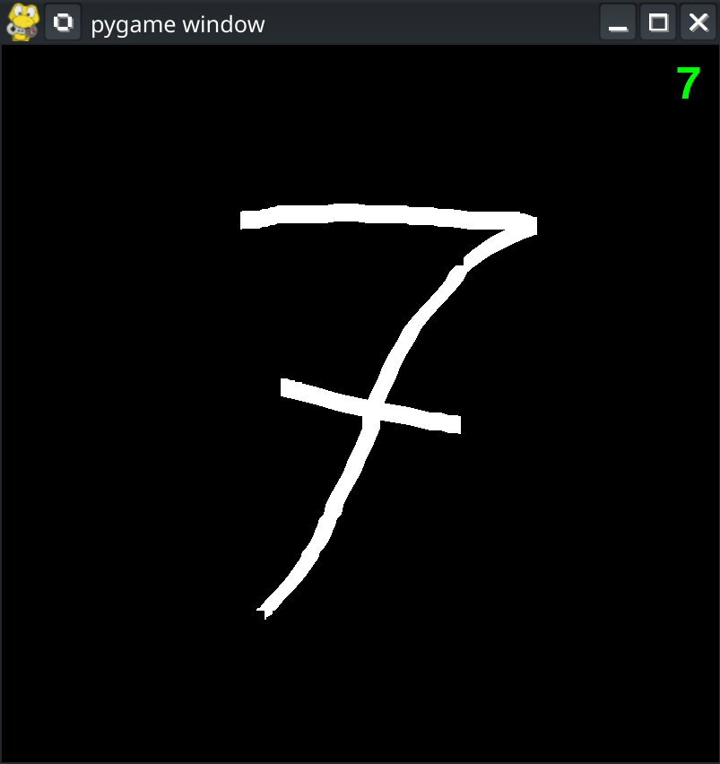
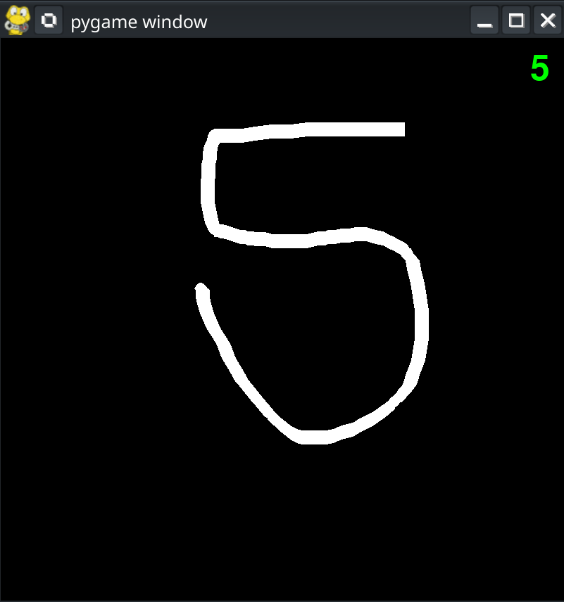
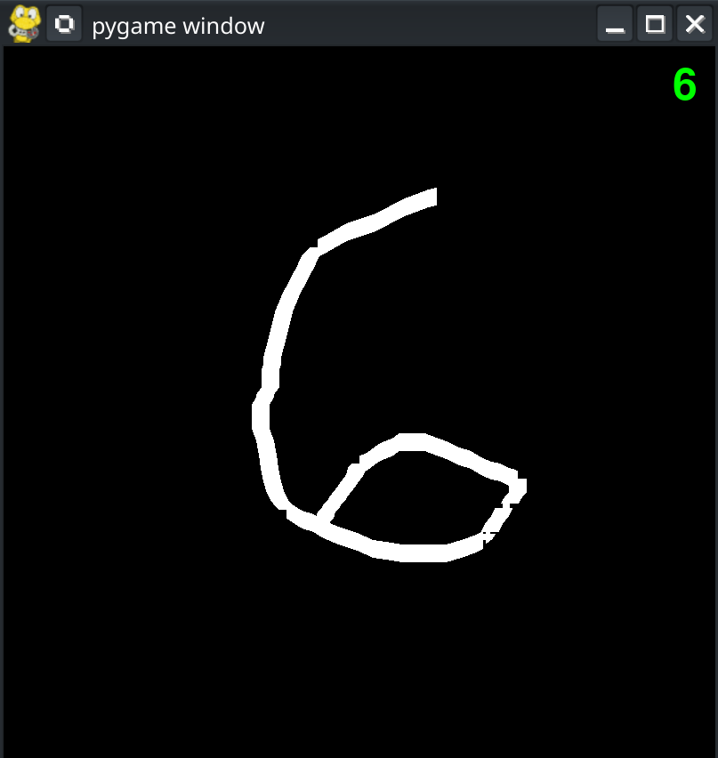
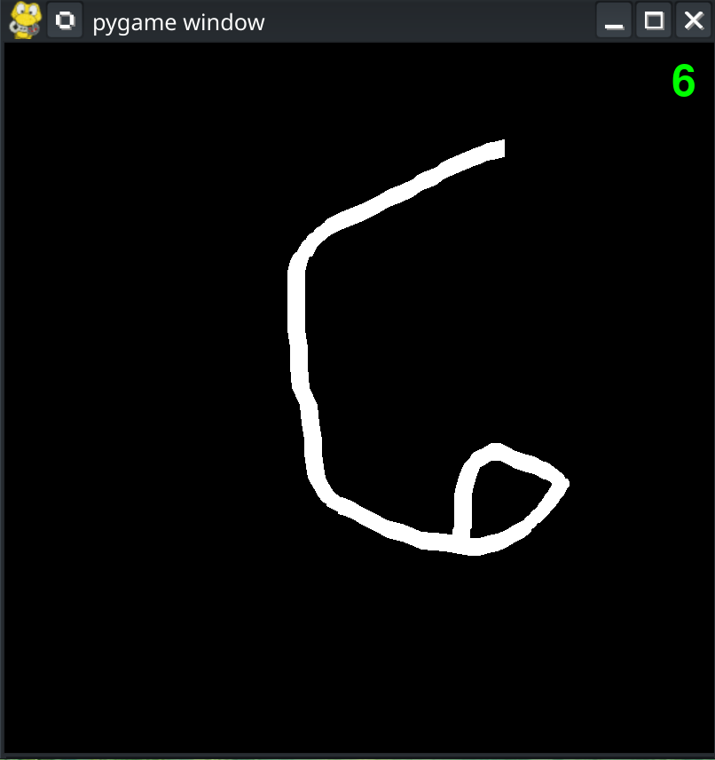

# Real-Time Handwritten Digit Recognition

A neural network-powered application that recognizes handwritten digits (0–9) in real time. Draw a number on the canvas and the model will instantly predict which digit you wrote.

## Features

- Real-time digit recognition
- Interactive drawing canvas
- Neural network trained on handwritten digit data
- PyTorch-based implementation
- GPU (CUDA) and CPU support

## Demo


<p align="center">
  
  
</p>

<p align="center">
  
  
</p>


## Installation

### 1. Create a Virtual Environment

**Windows**
```bash
python -m venv venv
venv\Scripts\activate
```

**Linux / macOS**
```bash
python3 -m venv venv
source venv/bin/activate
```

### 2. Install PyTorch

#### CUDA (NVIDIA GPU)
```bash
pip3 install torch torchvision --index-url https://download.pytorch.org/whl/cu130
```

#### CPU Only
```bash
pip3 install torch torchvision --index-url https://download.pytorch.org/whl/cpu
```

### 3. Install Project Dependencies

```bash
pip install -r requirements.txt
```

### 4. Run the Application

```bash
python main.py
```

